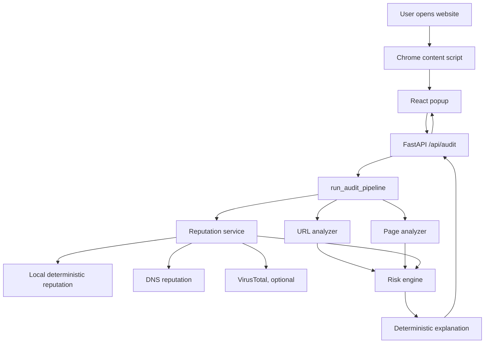
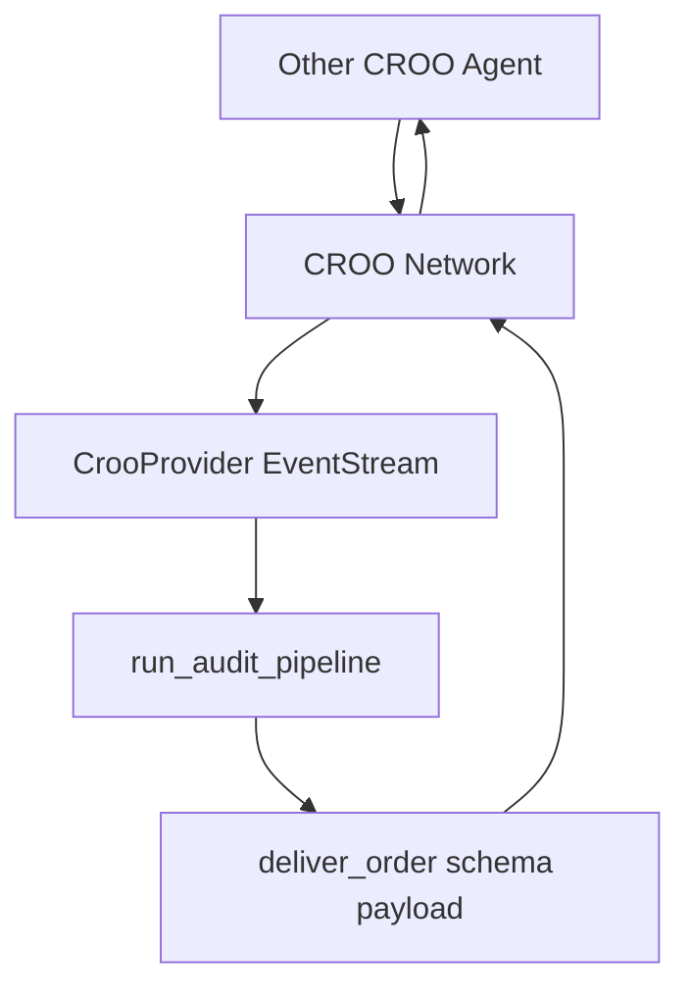

# Threat Detection Agent Developer Guide

## Table of Contents

1. [Project Overview](#project-overview)
2. [Architecture](#architecture)
3. [Repository Structure](#repository-structure)
4. [Feature Breakdown](#feature-breakdown)
5. [Backend Guide](#backend-guide)
6. [Frontend / Chrome Extension Guide](#frontend--chrome-extension-guide)
7. [CROO Integration](#croo-integration)
8. [VirusTotal Threat Intelligence](#virustotal-threat-intelligence)
9. [Authentication, Authorization, and Rate Limiting](#authentication-authorization-and-rate-limiting)
10. [Database](#database)
11. [Course Management](#course-management)
12. [Configuration](#configuration)
13. [Deployment](#deployment)
14. [Customization Guide](#customization-guide)
15. [Developer Notes](#developer-notes)
16. [Common Commands](#common-commands)

## Project Overview

Threat Detection Agent is an explainable browser security project. The user-facing product is the Chrome extension named **TrustTab**. The CROO-facing service is registered as **Threat Detection Agent**.

The project analyzes the active browser tab and returns a deterministic risk report. It does not use a production ML model yet. The current engine is rule-based and explainable, with optional external threat-intelligence enrichment through VirusTotal.

Primary goals:

- Detect phishing-like URL and page patterns.
- Produce a transparent risk score from `0` to `100`.
- Explain which signals caused the score.
- Display the report in a Chrome Manifest V3 popup.
- Expose the same audit capability through a CROO provider process for agent-to-agent use.

Technology stack:

- Frontend/extension: React, TypeScript, Vite, Tailwind CSS, Framer Motion, TanStack Query, Chrome Manifest V3 APIs.
- Backend: Python, FastAPI, Pydantic, Uvicorn.
- Security/reputation: deterministic URL/page rules, DNS reputation checks, optional VirusTotal v3 URL report lookup.
- CROO: `croo` SDK, `AgentClient`, `EventStream`, schema deliverables.
- Deployment: Render Web Service via `render.yaml` and `backend/start.sh`.

## Architecture

High-level runtime architecture:



CROO runtime architecture:



Important separation:

- `/api/audit` is the extension HTTP path. It runs the audit pipeline directly.
- `CrooProvider` is the CROO network path. It listens to CROO events and runs the same audit pipeline.
- `/api/audit` must not create CROO negotiations or orders.
- The legacy `/api/croo` router exists in code but is not mounted in `app/main.py`.

## Repository Structure

```text
Threat-Detection-Agent/
├── README.md
├── DEVELOPER_GUIDE.md
├── CROO_SCHEMAS.md
├── render.yaml
├── backend/
│   ├── README.md
│   ├── requirements.txt
│   ├── start.sh
│   ├── .env.example
│   ├── app/
│   │   ├── main.py
│   │   ├── config.py
│   │   ├── api/
│   │   │   ├── audit.py
│   │   │   └── croo.py
│   │   ├── schemas/
│   │   │   ├── request.py
│   │   │   └── response.py
│   │   └── services/
│   │       ├── audit_pipeline.py
│   │       ├── url_analyzer.py
│   │       ├── page_analyzer.py
│   │       ├── reputation.py
│   │       ├── risk_engine.py
│   │       ├── explanation.py
│   │       ├── croo_provider.py
│   │       ├── croo_service.py
│   │       ├── croo_services.py
│   │       └── test_requester.py
│   └── tests/
│       ├── test_croo_service.py
│       ├── test_reputation.py
│       └── test_security_controls.py
└── web-agent/
    ├── README.md
    ├── package.json
    ├── manifest.json
    ├── vite.config.ts
    ├── tailwind.config.ts
    └── src/
        ├── main.tsx
        ├── App.tsx
        ├── popup/Popup.tsx
        ├── content.ts
        ├── background.ts
        ├── components/
        ├── hooks/
        ├── services/
        ├── types/
        └── utils/
```

## Feature Breakdown

### Chrome Extension Popup

Purpose: Show the user a security report for the current browser tab.

Implemented in:

- `web-agent/manifest.json`
- `web-agent/src/main.tsx`
- `web-agent/src/App.tsx`
- `web-agent/src/popup/Popup.tsx`
- `web-agent/src/components/*`

How it works:

1. User opens the extension popup.
2. `Popup` calls `useCurrentTab()`.
3. `useCurrentTab()` calls `getCurrentTab()`.
4. `getCurrentTab()` asks the content script for page metadata.
5. `Popup` calls `useAudit(website)`.
6. `useAudit()` sends metadata to the backend through `auditWebsite()`.
7. The response is normalized into `AuditReport`.
8. UI cards display score, meter, summary, evidence, recommendation, and timeline.

### Page Metadata Collection

Purpose: Collect safe, lightweight page signals from the active tab without backend page fetching.

Implemented in:

- `web-agent/src/content.ts`
- `web-agent/src/services/chrome.ts`

Collected fields:

- `url`
- `title`
- `pageText`, truncated to 5000 characters
- number of forms
- number of script tags
- number of password fields
- number of iframes

This design avoids server-side crawling and reduces SSRF risk.

### Audit API

Purpose: Public HTTP entry point used by the extension.

Implemented in:

- `backend/app/api/audit.py`
- `backend/app/schemas/request.py`
- `backend/app/schemas/response.py`

Endpoint:

```text
POST /api/audit
POST /api/audit/
```

Input model: `AuditRequest`

Output model: `AuditResponse`

The route:

- optionally checks `AUDIT_API_KEY`;
- applies in-memory per-client rate limiting;
- calls `run_audit_pipeline()`;
- converts `ValueError` validation failures into HTTP `400`;
- returns the same JSON shape expected by the extension.

### Rule-Based URL Analysis

Purpose: Score URL-level phishing indicators.

Implemented in:

- `backend/app/services/url_analyzer.py`

Important functions:

- `validate_public_audit_url(url) -> None`
- `analyze_url(url) -> dict[str, object]`

Signals:

- invalid URL format
- non-HTTPS URL
- IP-address hostname
- long URL
- known URL shorteners
- suspicious keywords
- suspicious TLDs
- excessive subdomains
- `@` in authority
- non-standard ports
- long paths/queries
- many query params
- encoded characters
- punycode
- multiple hyphens
- digit-heavy/random-looking domain labels
- brand impersonation against known official domains

Security validation blocks:

- localhost
- `.localhost`
- private IP ranges
- loopback IPs
- link-local IPs
- reserved/unspecified/multicast IPs
- cloud metadata IP `169.254.169.254`
- `metadata.google.internal`

### Rule-Based Page Analysis

Purpose: Score page-content and DOM metadata indicators submitted by the extension.

Implemented in:

- `backend/app/services/page_analyzer.py`

Important function:

- `analyze_page(url, title, page_text, html, forms, scripts, password_fields, iframes) -> dict[str, object]`

Signals:

- phishing phrases
- urgent language
- forms
- password fields
- sensitive action terms
- forms combined with credential/payment language
- hidden iframes
- many iframes
- suspicious JavaScript patterns
- many external scripts
- brand references on non-official domains
- captcha/human verification with form input
- very little readable content

### Reputation Analysis

Purpose: Combine local reputation heuristics, DNS reputation checks, and optional VirusTotal enrichment.

Implemented in:

- `backend/app/services/reputation.py`

Important classes/functions:

- `ReputationService`
- `DNSReputationClient`
- `VirusTotalClient`
- `_virustotal_url_id(url)`
- `_score_virustotal_stats(stats)`

Local signals:

- known trusted domains
- high-risk URL terms
- excessive hyphens in hostname

DNS signals:

- missing A/AAAA address records
- private/local/reserved address resolutions
- missing nameserver records
- single nameserver resilience warning
- missing MX records as low-confidence context

VirusTotal signals:

- `last_analysis_stats.malicious`
- `last_analysis_stats.suspicious`
- `last_analysis_stats.harmless`
- `last_analysis_stats.undetected`
- `reputation`
- `last_analysis_date`
- report permalink

### Risk Scoring

Purpose: Merge URL, page, and reputation scores into one user-facing result.

Implemented in:

- `backend/app/services/risk_engine.py`

Important functions:

- `calculate_risk(url_analysis, page_analysis, reputation_analysis) -> dict[str, object]`
- `_risk_level(score) -> str`
- `_recommendation(score) -> str`

Current weights:

- URL score: `38%`
- page score: `47%`
- reputation score: `15%`

Risk levels:

- `0-25`: `Safe`
- `26-60`: `Medium`
- `61-100`: `High`

The engine also boosts the final score when any component is very high, so strong individual signals do not get hidden by the weighted average.

### Explanation Generation

Purpose: Produce a deterministic natural-language summary of the evidence and recommendation.

Implemented in:

- `backend/app/services/explanation.py`

Important function:

- `generate_explanation(risk_result) -> str`

This is not LLM-generated today. It is template-based and uses the calculated score, level, recommendation, and leading reasons.

### CROO Provider

Purpose: Expose the audit pipeline to other CROO agents.

Implemented in:

- `backend/app/services/croo_provider.py`
- `backend/app/main.py`
- `backend/app/services/test_requester.py`
- `CROO_SCHEMAS.md`

How it works:

1. FastAPI startup creates a background task for `CrooProvider.start()` when CROO env vars are present.
2. `CrooProvider` connects to CROO EventStream.
3. CROO events are routed to `_handle_event()`.
4. Negotiation-only events call `_accept_negotiation()`.
5. Payload/order events call `_deliver_analysis()`.
6. `_perform_analysis()` extracts URL/page fields and calls `run_audit_pipeline()`.
7. Results are delivered as `DeliverableType.SCHEMA` with JSON in `deliverable_schema`.

Known CROO limitation:

- `accept_negotiation()` can fail if the CROO account/wallet has no required sponsorship/token balance. This is a network/payment-layer issue, not an audit pipeline issue.

### Render Single-Service Hosting

Purpose: Run FastAPI and the CROO provider in one Render Web Service.

Implemented in:

- `render.yaml`
- `backend/start.sh`
- `backend/app/main.py`

Important caveat:

- Render free tier can sleep after inactivity. If it sleeps, the CROO WebSocket disconnects until the service wakes again.

## Backend Guide

### `backend/app/main.py`

Responsibilities:

- create FastAPI app;
- install CORS middleware;
- mount audit router;
- start `CrooProvider` at app startup if configured;
- stop `CrooProvider` at app shutdown;
- expose `/` and `/health`.

Functions:

- `_log_croo_start_result(task)`: logs/prints background startup result.
- `start_croo_provider()`: FastAPI startup hook; schedules `croo_provider.start()`.
- `stop_croo_provider()`: FastAPI shutdown hook; stops provider and cancels startup task if needed.
- `root()`: returns `{"status": "running"}`.
- `health()`: returns `status`, `croo_provider_configured`, and `croo_provider_started`.

### `backend/app/config.py`

Central environment configuration.

Settings:

- `APP_NAME`
- `APP_VERSION`
- `CORS_ORIGINS`
- `TRUSTTAB_EXTENSION_ORIGIN`
- `AUDIT_API_KEY`
- `AUDIT_RATE_LIMIT_PER_MINUTE`
- `VIRUSTOTAL_API_KEY`
- `VIRUSTOTAL_TIMEOUT_SECONDS`
- `VIRUSTOTAL_CACHE_TTL_SECONDS`
- `VIRUSTOTAL_SUBMIT_UNKNOWN_URLS`

### `backend/app/api/audit.py`

Responsibilities:

- define `/api/audit`;
- enforce optional API key;
- enforce rate limiting;
- call audit pipeline;
- return `AuditResponse`.

Important helpers:

- `_client_key(http_request)`: uses `x-forwarded-for` if present, otherwise request client host.
- `_enforce_rate_limit(http_request)`: sliding-window in-memory limiter.
- `_enforce_audit_api_key(x_trusttab_api_key, x_api_key)`: checks optional API key.
- `audit(request, http_request, x_trusttab_api_key, x_api_key)`: endpoint function.

Inputs:

- `AuditRequest`
- optional headers:
  - `X-TrustTab-API-Key`
  - `X-API-Key`

Output:

- `AuditResponse`

### `backend/app/schemas/request.py`

Pydantic request models:

- `AuditRequest`: extension/backend audit payload.
- `CrooInvokeRequest`: legacy CROO invocation route payload.

`AuditRequest` fields:

- `url`: required
- `title`
- `page_text`
- `html`
- `domain`
- `favicon`
- `https`
- `forms`
- `scripts`
- `password_fields`
- `iframes`

### `backend/app/schemas/response.py`

Pydantic response models:

- `CrooAuditResponse`
- `AuditResponse`
- `CrooAgent`
- `CrooAgentsResponse`
- `CrooInvokeResponse`

`AuditResponse` fields:

- `url`
- `risk_score`
- `risk_level`
- `reasons`
- `recommendation`
- `explanation`
- `evidence`
- `threat_intel`
- `croo`

### `backend/app/services/audit_pipeline.py`

Main orchestration function:

```python
run_audit_pipeline(
    url,
    title="",
    page_text="",
    html="",
    forms=None,
    scripts=None,
    password_fields=None,
    iframes=None,
)
```

Call sequence:

1. `validate_public_audit_url(url)`
2. `analyze_url(url)`
3. `analyze_page(...)`
4. `reputation_service.analyze(url)`
5. `calculate_risk(...)`
6. `generate_explanation(...)`
7. return normalized report dictionary

Called by:

- `/api/audit`
- `CrooProvider._perform_analysis()`
- tests

### `backend/app/services/url_analyzer.py`

Pure deterministic URL analysis. It does not fetch remote resources.

Important outputs:

```python
{
    "score": int,
    "reasons": list[str],
}
```

### `backend/app/services/page_analyzer.py`

Pure deterministic page metadata analysis. It uses extension-provided fields and HTML/text snippets.

Important outputs:

```python
{
    "score": int,
    "reasons": list[str],
}
```

### `backend/app/services/reputation.py`

Combines local reputation, DNS checks, and VirusTotal.

`VirusTotalClient.analyze_url(url)`:

- returns `None` if no API key is configured;
- checks in-memory cache;
- fetches existing VirusTotal URL report;
- optionally submits unknown URLs if enabled;
- returns a normalized reputation result.

`DNSReputationClient.analyze_url(url)`:

- returns `None` when DNS checks are disabled;
- returns unavailable result if `dnspython` is not installed;
- resolves A/AAAA for the hostname;
- resolves MX/NS/TXT for the registered domain;
- flags private/reserved IP answers and missing records.

`ReputationService.analyze(url)`:

- runs local reputation;
- optionally runs DNS reputation;
- optionally runs VirusTotal;
- merges provider results into one score and reason list.

### `backend/app/services/risk_engine.py`

Consumes analyzer outputs and returns:

```python
{
    "risk_score": int,
    "risk_level": "Safe" | "Medium" | "High",
    "reasons": list[str],
    "recommendation": str,
    "components": {
        "url": int,
        "page": int,
        "reputation": int,
    },
    "threat_intel": {...},
}
```

### `backend/app/services/explanation.py`

Creates deterministic, plain-language explanation text from the risk result.

### `backend/app/services/croo_provider.py`

Real CROO SDK integration boundary.

Important methods:

- `is_configured`: true when `CROO_API_KEY`, `CROO_BASE_URL`, and `CROO_WS_URL` are present.
- `start()`: creates SDK client, connects websocket, registers event handler.
- `_connect_websocket()`: adapts to SDK signatures that may or may not accept service id.
- `stop()`: closes stream/client.
- `_dispatch_event(event)`: schedules async handling.
- `_handle_event(event)`: accepts negotiations or delivers analysis.
- `_accept_negotiation(negotiation_id)`: accepts a CROO negotiation.
- `_deliver_analysis(payload, event)`: analyzes payload and delivers schema result.
- `_perform_analysis(payload)`: extracts URL/page fields and calls `run_audit_pipeline`.
- `_extract_payload`, `_extract_url`, `_extract_int`, `_extract_order_id`, `_extract_negotiation_id`: tolerate multiple SDK/event payload shapes.

Direct execution:

```bash
python -m app.services.croo_provider
```

This starts the CROO provider as a standalone process and keeps it alive until Ctrl+C.

### `backend/app/services/test_requester.py`

Developer utility that acts as a second CROO requester agent.

Purpose:

- test `negotiate_order -> accept` flow against your registered service;
- does not call `pay_order()`;
- does not deliver or check final output.

Required env vars:

- `CROO_BASE_URL`
- `CROO_REQUESTER_API_KEY`
- `CROO_SERVICE_ID`

Run:

```bash
python -m app.services.test_requester https://example.com
```

### `backend/app/api/croo.py`

Legacy HTTP CROO simulation routes.

Important:

- This router is not included in `backend/app/main.py`.
- The extension does not call these routes.
- Keep this unmounted unless you intentionally want HTTP-based CROO testing.

## Frontend / Chrome Extension Guide

### Entry Points

- `web-agent/src/main.tsx`: React root entry.
- `web-agent/src/App.tsx`: renders `Popup`.
- `web-agent/src/popup/Popup.tsx`: main popup page.
- `web-agent/src/content.ts`: content script for page metadata.
- `web-agent/src/background.ts`: extension service worker.

### Manifest

File:

- `web-agent/manifest.json`

Important fields:

- `manifest_version: 3`
- popup: `index.html`
- permissions: `activeTab`, `tabs`, `storage`, `scripting`
- host permissions: `<all_urls>`
- background service worker: `assets/background.js`
- content script: `assets/content.js`

The Vite config outputs built assets into paths referenced by the manifest.

### Popup Flow

`Popup.tsx` owns popup UI state:

- `settingsOpen`
- `detailsExpanded`

It combines:

- `useCurrentTab()` for browser tab metadata
- `useAudit(website)` for backend report

It renders:

- `Header`
- `LoadingScreen`
- `ErrorCard`
- `WebsiteCard`
- `SecurityScore`
- `RiskMeter`
- `SummaryCard`
- `EvidenceList`
- `RecommendationCard`
- `AnalysisTimeline`
- `Footer`
- `SettingsModal`

### Hooks

`web-agent/src/hooks/useCurrentTab.ts`

- Uses TanStack Query.
- Calls `getCurrentTab()`.
- Does not retry restricted pages.

`web-agent/src/hooks/useAudit.ts`

- Uses TanStack Query.
- Builds audit payload from `WebsiteInfo`.
- Uses a preview audit for unauditable/restricted URLs.
- Exposes `audit`, `refresh`, and query state.

### Frontend Services

`web-agent/src/services/chrome.ts`

- Queries active tab through `chrome.tabs.query`.
- Rejects restricted browser pages such as `chrome://`, `about:`, and `edge://`.
- Sends `TRUSTTAB_PAGE_METADATA` message to content script.
- Converts response to `WebsiteInfo`.

`web-agent/src/services/api.ts`

- Sends `POST` request to `API_URL`.
- Current default:

```ts
const API_URL = 'http://localhost:8000/api/audit'
```

- Reads cached audit from `localStorage` if backend is unreachable.
- Normalizes backend shape into frontend `AuditReport`.

If `AUDIT_API_KEY` is enabled on the backend, this file must add:

```ts
'X-TrustTab-API-Key': '<configured key>'
```

Do not hardcode a secret in a public extension for real production use. For a local/private demo, it can be acceptable.

### Components

- `Header.tsx`: extension title, active domain, backend status.
- `WebsiteCard.tsx`: current tab/domain/protocol metadata.
- `SecurityScore.tsx`: animated circular score display.
- `RiskMeter.tsx`: Safe/Caution/Risky range bar.
- `SummaryCard.tsx`: explanation text.
- `EvidenceList.tsx`: list wrapper for evidence cards.
- `EvidenceCard.tsx`: single evidence item with icon/status.
- `RecommendationCard.tsx`: user action recommendation.
- `AnalysisTimeline.tsx`: visual analysis progress sequence.
- `LoadingScreen.tsx`: animated loading state.
- `ErrorCard.tsx`: backend/local setup failure state.
- `SettingsModal.tsx`: UI-only settings toggles.
- `Footer.tsx`: refresh/details/settings controls.
- `SkeletonLoader.tsx`: reusable skeleton placeholder.

### Types

- `web-agent/src/types/audit.ts`: frontend audit models.
- `web-agent/src/types/website.ts`: active website metadata model.
- `web-agent/src/types/chrome.d.ts`: Chrome API typing.

### Utilities

- `web-agent/src/utils/score.ts`: score clamp, verdict mapping, recommendation mapping.
- `web-agent/src/utils/format.ts`: domain/format helpers.

## CROO Integration

### Provider Mode

Provider mode is the real CROO service mode.

Run locally:

```bash
cd backend
python -m app.services.croo_provider
```

Run on Render:

- FastAPI startup hook in `app/main.py` starts `CrooProvider` automatically.

Required env vars:

```text
CROO_API_KEY=service_owner_key
CROO_BASE_URL=https://api.croo.network
CROO_WS_URL=wss://api.croo.network/ws
CROO_SERVICE_ID=registered_service_id
```

### Requester Test Mode

Run from local machine with a second requester key:

```bash
cd backend
export CROO_BASE_URL=https://api.croo.network
export CROO_SERVICE_ID=your_service_id
export CROO_REQUESTER_API_KEY=second_agent_key
python -m app.services.test_requester https://example.com
```

Expected success:

```text
SUCCESS: negotiation accepted
negotiation_id: ...
order_id: ...
```

Known errors:

- `cannot negotiate own service`: requester key belongs to the same identity as service owner.
- `PROVIDER_NOT_ACCEPTING_ORDERS`: provider is not connected or service is sleeping.
- `sender has no balance of the token for ERC20 sponsorship`: CROO payment/sponsorship balance issue.

### Schemas

See:

- `CROO_SCHEMAS.md`

This file contains JSON-style request/response schema information for the CROO dashboard.

## VirusTotal Threat Intelligence

VirusTotal is optional. Without `VIRUSTOTAL_API_KEY`, the backend uses only local deterministic reputation.

Environment variables:

```text
VIRUSTOTAL_API_KEY=
VIRUSTOTAL_TIMEOUT_SECONDS=3
VIRUSTOTAL_CACHE_TTL_SECONDS=3600
VIRUSTOTAL_SUBMIT_UNKNOWN_URLS=false
```

Behavior:

- Existing URL report lookup uses `GET /api/v3/urls/{id}`.
- URL id is unpadded URL-safe base64 of the full URL.
- Unknown URLs are not submitted by default.
- If `VIRUSTOTAL_SUBMIT_UNKNOWN_URLS=true`, unknown URLs are submitted through `POST /api/v3/urls`.
- Results are cached in memory by full URL.
- Cache resets when the backend process restarts.

Returned `threat_intel` shape:

```json
{
  "provider": "local+virustotal",
  "dns": {
    "available": true,
    "score": 0,
    "records": {
      "a": ["93.184.216.34"],
      "aaaa": [],
      "mx": [],
      "ns": ["a.iana-servers.net"],
      "txt": []
    }
  },
  "virustotal": {
    "available": true,
    "cache": "hit",
    "submitted": false,
    "analysis_id": null,
    "score": 0,
    "stats": {},
    "reputation": 0,
    "last_analysis_date": 1234567890,
    "permalink": "https://www.virustotal.com/api/v3/urls/..."
  }
}
```

## Authentication, Authorization, and Rate Limiting

There is no user login system.

Current auth model:

- `/api/audit` is open by default.
- If `AUDIT_API_KEY` is configured, clients must send:

```text
X-TrustTab-API-Key: your_key
```

or:

```text
X-API-Key: your_key
```

Rate limiting:

- Implemented in `backend/app/api/audit.py`.
- In-memory sliding window.
- Default: `60` requests per minute per client key.
- Uses `x-forwarded-for` when present.
- Not shared between processes or instances.

Limitations:

- No users.
- No roles.
- No sessions.
- No two-factor authentication.
- No persistent API-key management.

## Database

There is currently no database.

No implemented:

- schema migrations
- ORM models
- DocTypes
- relationships
- persisted audit history
- user accounts
- saved settings
- certificates or progress tables

Current storage:

- Backend: in-memory rate-limit buckets and VirusTotal cache.
- Extension: `localStorage` cache for audit reports by domain.
- Chrome extension: `chrome.storage.local` stores `trusttabInstalledAt`.

Future database candidates:

- audit history table
- threat-intel cache table
- domain reputation snapshot table
- user/team table
- API key table
- extension settings table

## Course Management

This project is not a learning-management or course platform.

Not applicable:

- courses
- lessons
- chapters
- quizzes
- progress tracking
- certificates
- Q&A
- community
- notes

If these items appear in planning templates, ignore them for this repository unless the product scope changes.

## Configuration

### Backend Environment Variables

| Variable | Required | Default | Purpose |
|---|---:|---|---|
| `APP_NAME` | No | `Threat Detection Agent` | FastAPI app title |
| `APP_VERSION` | No | `1.0.0` | FastAPI app version |
| `CORS_ORIGINS` | Recommended | empty | Comma-separated allowed origins |
| `TRUSTTAB_EXTENSION_ORIGIN` | Optional | empty | Fallback single extension origin |
| `AUDIT_API_KEY` | Optional | empty | Enables lightweight `/api/audit` API-key auth |
| `AUDIT_RATE_LIMIT_PER_MINUTE` | No | `60` | Per-client audit rate limit; `0` disables |
| `VIRUSTOTAL_API_KEY` | Optional | empty | Enables VirusTotal enrichment |
| `VIRUSTOTAL_TIMEOUT_SECONDS` | No | `3` | VirusTotal HTTP timeout |
| `VIRUSTOTAL_CACHE_TTL_SECONDS` | No | `3600` | In-memory VirusTotal cache TTL |
| `VIRUSTOTAL_SUBMIT_UNKNOWN_URLS` | No | `false` | Whether unknown URLs are submitted to VirusTotal |
| `DNS_REPUTATION_ENABLED` | No | `true` | Enables DNS reputation checks |
| `DNS_TIMEOUT_SECONDS` | No | `2` | DNS resolver timeout/lifetime |
| `CROO_API_KEY` | CROO only | empty | Service owner CROO API key |
| `CROO_BASE_URL` | CROO only | empty | CROO REST base URL |
| `CROO_WS_URL` | CROO only | empty | CROO websocket URL |
| `CROO_SERVICE_ID` | CROO only | empty | Registered CROO service id |
| `CROO_REQUESTER_API_KEY` | requester test only | empty | Second agent key for `test_requester.py` |

### Frontend Configuration

The backend URL is currently hardcoded in:

- `web-agent/src/services/api.ts`

Current default:

```ts
const API_URL = 'http://localhost:8000/api/audit'
```

For deployed backend use:

```ts
const API_URL = 'https://your-render-url.onrender.com/api/audit'
```

For a production extension, prefer moving this into a build-time env var instead of editing source for each environment.

## Deployment

### Local Backend

```bash
cd backend
python3 -m venv venv
source venv/bin/activate
pip install -r requirements.txt
cp .env.example .env
uvicorn app.main:app --reload
```

Windows activation:

```powershell
venv\Scripts\activate
```

Local URLs:

- API root: `http://127.0.0.1:8000`
- audit endpoint: `http://127.0.0.1:8000/api/audit`
- health endpoint: `http://127.0.0.1:8000/health`
- Swagger docs: `http://127.0.0.1:8000/docs`

### Local Frontend / Extension

```bash
cd web-agent
npm install
npm run build
```

Load extension:

1. Open `chrome://extensions/`.
2. Enable Developer Mode.
3. Click Load unpacked.
4. Select `web-agent/dist`.

After frontend changes:

```bash
npm run build
```

Then reload the extension from `chrome://extensions/`.

### Render Deployment

Files:

- `render.yaml`
- `backend/start.sh`

Render settings:

```text
Root directory: backend
Build command: pip install -r requirements.txt
Start command: sh start.sh
```

The start script:

```sh
uvicorn app.main:app --host 0.0.0.0 --port "${PORT:-8000}"
```

Render health check:

```text
https://your-render-url.onrender.com/health
```

Expected response:

```json
{
  "status": "ok",
  "croo_provider_configured": true,
  "croo_provider_started": true
}
```

Free-tier caveat:

- Render free services can sleep.
- When sleeping, `/api/audit` cold-starts and the CROO websocket disconnects.
- For reliable CROO calls, use an always-on service.

### Migrations and Fixtures

There are no database migrations or fixtures today because there is no database.

## Customization Guide

### Change UI Text

Edit React components under:

- `web-agent/src/components/`
- `web-agent/src/popup/Popup.tsx`

### Change Visual Styling

Edit:

- `web-agent/src/index.css`
- `web-agent/src/App.css`
- Tailwind classes inside component files
- `web-agent/src/constants/colors.ts`

### Change Backend URL

Edit:

- `web-agent/src/services/api.ts`

Longer-term improvement:

- replace hardcoded `API_URL` with a Vite env variable.

### Add a New URL Rule

Edit:

- `backend/app/services/url_analyzer.py`

Pattern:

1. Add constant or helper if needed.
2. Add score increment.
3. Add human-readable reason.
4. Add/update tests.

### Add a New Page Rule

Edit:

- `backend/app/services/page_analyzer.py`

Follow the same pattern: score plus explainable reason.

### Change Score Weighting

Edit:

- `backend/app/services/risk_engine.py`

Be careful changing thresholds because frontend verdict labels depend on backend risk levels and frontend `utils/score.ts` maps equivalent score ranges.

### Add a New Threat-Intel Provider

Edit:

- `backend/app/services/reputation.py`

Preferred structure:

1. Add provider client class.
2. Normalize provider response to `{"score": int, "reasons": list[str], ...}`.
3. Merge in `ReputationService`.
4. Add provider details under `threat_intel`.
5. Keep provider failures non-fatal.
6. Add tests with mocked HTTP responses.

### Extend CROO Schema

Edit:

- `CROO_SCHEMAS.md`
- `backend/app/services/croo_provider.py`
- `backend/app/schemas/response.py` if HTTP output also changes

Keep CROO output as `DeliverableType.SCHEMA`.

## Developer Notes

### Common Pitfalls

- Do not route `/api/audit` through `CrooService` or `CrooProvider.invoke_agent()`. Extension scans should never create CROO orders.
- Do not claim production AI/ML detection until the ML classifier exists.
- VirusTotal is optional and can be rate-limited; provider errors must not break local deterministic analysis.
- In-memory caches/rate limits reset on deploy/restart.
- Render free tier sleeping affects CROO provider availability.
- The extension cannot analyze restricted Chrome pages.
- If backend `AUDIT_API_KEY` is enabled, the extension must send the matching header.
- `web-agent/src/services/api.ts` currently hardcodes local backend URL.
- The frontend caches reports in `localStorage`; stale cached results can hide backend failures during manual testing.
- `backend/app/api/croo.py` is unmounted; do not assume those HTTP routes are live.

### Known Issues / Gaps

- No persistent database.
- No user accounts or role-based auth.
- No durable rate limiting across multiple server instances.
- No production ML classifier yet.
- No LLM explanation layer yet.
- WHOIS/domain-age intelligence is not implemented yet.
- No screenshot visual spoofing yet.
- Firefox/Edge are not fully packaged/tested.
- CROO accept flow may fail without wallet/paymaster balance.

### Debugging Tips

Backend:

- Use `/health` to check web service and CROO provider state.
- Use `/docs` to test `/api/audit`.
- Check Render logs for startup prints from `app/main.py`.
- Use unit tests before deploy.

Extension:

- Rebuild after changes with `npm run build`.
- Reload unpacked extension in Chrome.
- Inspect popup with right-click -> Inspect.
- Refresh the target website if content script is not loaded.
- Clear `localStorage` cache if results look stale.

CROO:

- Run provider directly with `python -m app.services.croo_provider`.
- Run requester with `python -m app.services.test_requester https://example.com`.
- Use different CROO identities for provider and requester.
- Payment/sponsorship errors are external CROO account-state issues.

## Common Commands

Backend tests:

```bash
cd backend
python -m unittest discover tests
```

Backend compile check:

```bash
cd backend
python -m py_compile app/main.py app/api/audit.py app/services/*.py
```

Run backend locally:

```bash
cd backend
uvicorn app.main:app --reload
```

Run CROO provider locally:

```bash
cd backend
python -m app.services.croo_provider
```

Run CROO requester test:

```bash
cd backend
python -m app.services.test_requester https://example.com
```

Build extension:

```bash
cd web-agent
npm run build
```

Lint extension:

```bash
cd web-agent
npm run lint
```

Check git changes:

```bash
git status --short
git diff
```
